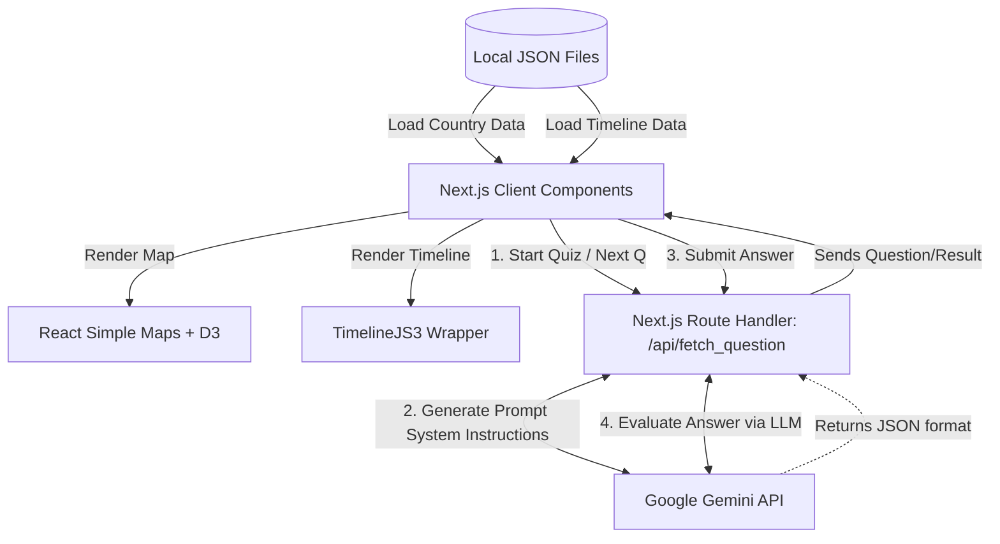

# 🌍 GeoKnowledge - Play For Knowledge

GeoKnowledge is an interactive, AI-powered educational platform designed to make learning global geography and history engaging. By combining dynamic SVG mapping, rich historical timelines, and an adaptive generative AI quiz engine, the platform offers a personalized journey through the world's cultures and pasts.

## ✨ Core Features
* **Interactive World Map:** A responsive, SVG-based interactive globe using `react-simple-maps` and `d3-geo`. Users can hover and click on countries to explore geographical data dynamically.
* **Rich Historical Timelines:** Integrates Northwestern University's Knight Lab `TimelineJS3` to render immersive, multimedia-rich historical timelines for nearly every country in the world, driven by highly structured JSON data.
* **AI-Powered Adaptive Quiz:** Features a dynamic quiz engine powered by the **Google Gemini API** (`gemini-2.5-flash`). The AI generates country-specific questions in real-time, adapting the difficulty (Beginner, Intermediate, Advanced) based on the user's ongoing performance and evaluating their answers on the fly.
* **Fluid Animations:** Utilizes `framer-motion` for smooth page transitions and interactive UI component feedback.

## 🚀 Technology Stack
* **Framework:** Next.js 15 (App Router) & React 19.
* **Styling:** Tailwind CSS v4.
* **Language:** TypeScript.
* **AI Integration:** `@google/genai` (Gemini 2.5 Flash model).
* **Mapping & Visualization:** `react-simple-maps`, `d3-geo`, `timelinejs3`.
* **Tooling:** Biome (for fast formatting and linting).

## 📐 Architecture Flow

